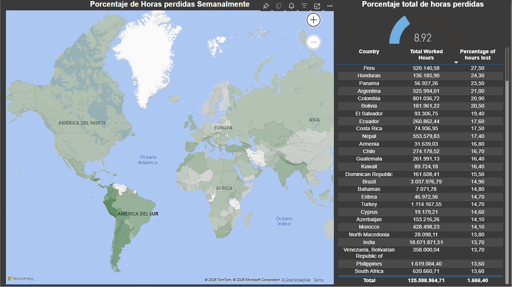
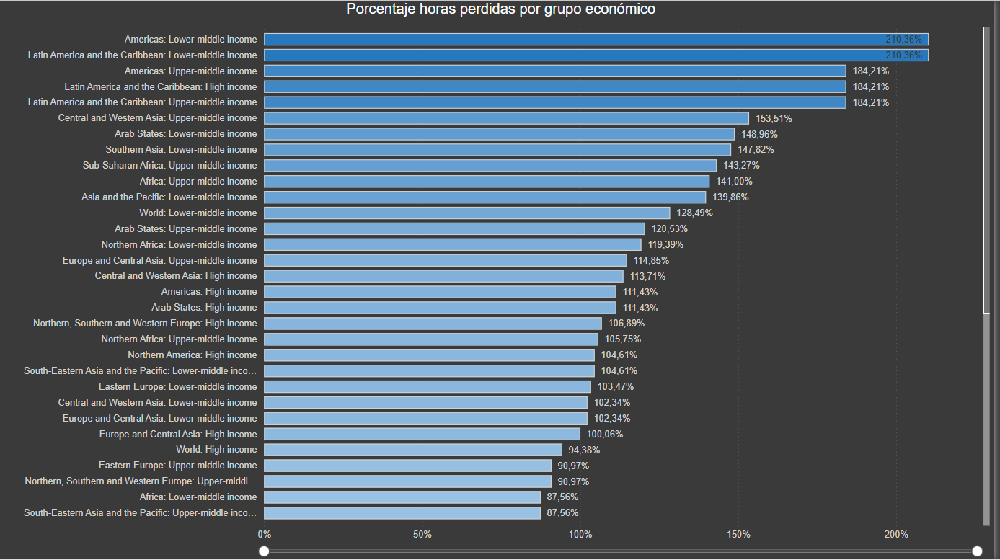
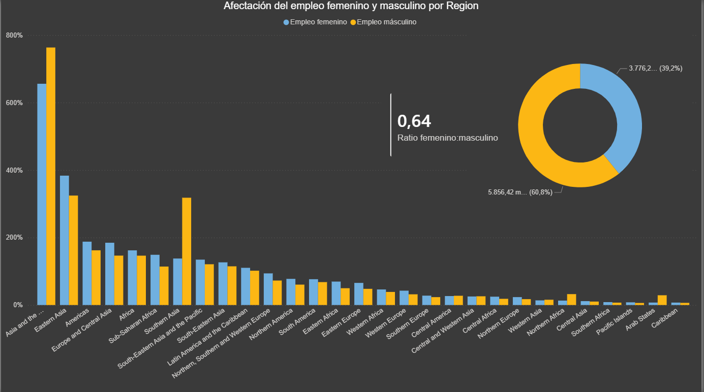

# Project 1: Impact of COVID-related absences from work on global productivity
**Introduction**: During my work as a telephone HR agent for a multinational company in the healthcare sector, I managed COVID-related sick leave that directly affected staff availability.
This project analyzes international data (for company privacy reasons) on lost working hours in different economic strata and regions, showing how similar phenomena are reflected on a large scale.  

**Objectives:**  
- Visualize the impact of COVID-19 on employment by gender, region, and country.
- Identify patterns between my work experience and global data.
- Demonstrate skills in data cleaning, modeling, and visualization with Excel and Power BI.

**Tools used:**  
|
|--|--|

## Dashboard  
**Page 1: Countries**  
  

**Page 2: Income Group**
  

**Page 3: Region female by male**
  

*I chose these three areas because in my previous job, I assisted employees from different States, job hierarchies, and genders. So I wanted to do something related to that.*
## Insights  
- Latin American countries experienced a higher loss of working hours compared to European countries. This demonstrates a lower level of preparation for global or local crises.
- The lowest economic groups were the most affected, with a higher percentage of lost working hours. This reflects the higher pressure and vulnerability of employees from lower social strata.
- In most regions, males were the most affected, reporting higher rates of work absence. However, these data are mostly due to the gender gap in employment.

## Data and Steps:
- `Covid_Employment_DB.pbix`: Dashboard in Power BI
- `COVID_Employment.xlsx`: Clean dataset
- `employment_data.csv`: Original data
Source: https://www.kaggle.com/datasets/vineethakkinapalli/impact-of-covid19-on-employment-ilostat

**Steps**
- The original data (csv) was cleaned and modeled in Excel.
- New columns were added to distinguish between countries, regions, and economic groups in Excel.
- The data was loaded into Power BI, and extra columns and measures were added using DAX formatting.
- Visuals for storytelling were built in Power BI.

Contact me:
|
|--|--|
